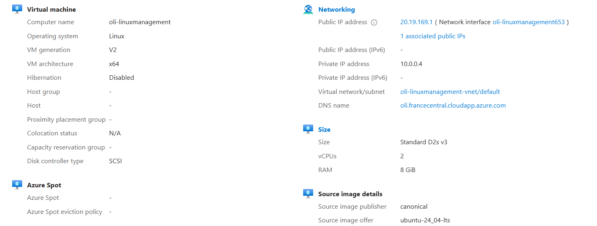
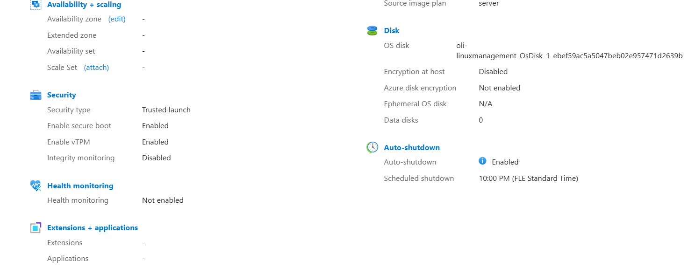

# Creating Ubuntu VM on Aure and SSH connection
This is my all documentation what I did during creating ubuntu virtual machine in azure and connection with SSH

## Step 1: Azure Account + Free Credits
First I logged into portal.azure.com with my HAMK email id.
Then I activated Azure for students with free credits.

## Step 2: Created Resources Group
I made a new resource group called SOS-HAMK in France Central

## Step 3: Created a virtual machine

.Image: Ubuntu server 24.04 LTS

.Size: Standard D2s v3

.Name: oli-linuxmanagement

.Authentication: SSH key

.Allowed SSH from my ip

After that I face a region issue and I fix it after a bit time , the Vm was ready

This is the VM overview 


## step 4: Connected with SSH using PuTTY

I downloaded PuTTY from the site.
Took the public IP from Azure ->opened PuTTY -> entered Ip + username + loaded my SSH key.

login worked perfectly! I got Ubuntu welcome message


## step 5: Connected with terminal

After completing all the steps I had run it with terminal as professor guidance. We also created shortcut key so that we can open it easily

# Assignment 3:
This assignment was to create users and use created users to test out file access permission

## Step 1: Creating user tupu using adduser script.
 I created user tupu by using adduser command. This command automatically creates the user account, home directory, and a user group.
```bash
sudo adduser tupo
```
Image:


## step 2: Creating user lupu using groupadd script.
I created user lupu by using useradd command to manually define the home directory, login shell, and user group

First, a group for lupu
```bash
sudo groupadd lupu
```
Then I created the user:
```bash
sudo groupadd lupu
```
Then I created the user:
```bash
sudo useradd -m -d /home/lupu -s /bin/bash -g lupu lupu
```
I set a password for the user:
```bash
sudo passwd lupu
```
Image:


## step 3: Creating system user hupu
I created a system user named hupu with the login shell set to /bin/false to prevent interactive login
```bash
sudo useradd --system --shell /bin/false hupu
```
This user is intended for system use only

Image:


## step 4: Granting sudo privileges to users
I added tupu and lupu to the sudo group so they could have administrative privileges when needed.
```bash
sudo usermod -aG sudo tupu
sudo usermod -aG sudo lupu
```
I verified their group membership using:
```bash
groups tupu
groups lupu
```

Image:


## step 5: Creating shared project directory and setting permissions
I created a shared directory /opt/projekti to allow access only to tupu and lupu.

First, I created the directory:
```bash
sudo mkdir /opt/projekti
```
Then, i created a common group called projekti and added both users to it:
```bash
sudo groupadd projekti
sudo usermod -aG projekti tupu
sudo usermod -aG projekti lupu
```
I set the group ownership and permissions:
```bash
sudo chown root:projekti /opt/projekti
sudo chmod 770 /opt/projekti
sudo chmod g+s /opt/projekti
ls -ld /opt/projekti
```
The setgid bit makes sure that any new files or folders created inside /opt/projekti automatically belong to the projekti group.

Image


## step 6: Testing file access permissions
I was curious about the final testing that it will work or not
.Test as tupu

```bash
su -tupu
cd /opt/projekti
touch test_tupup.txt
ls -l
```
Image


I forgot to take the screenshot at the exact moment when the directory was empty and the total value was 0 but I rememebr later and took the screenshot, where the total value was 4

. Test as lupu
```bash
su -lupu
cd /opt/projekti
echo "Hi" >> text_tupu.txt
touch test_lupu.txt
ls -l
```
Image


. Test as hupu

Here hupu is a unauthorized access so it should so access denied
```bash 
su - hupu
cd /opy/projektiimage
```
Image:


so we can see, for tupu and lupu it allow the access but for hupu it denies it which shows that our assignment is correct.

## Conclusion
This task help me to learn linux user and permission management using users, groups, sudo access, and directory permission control


